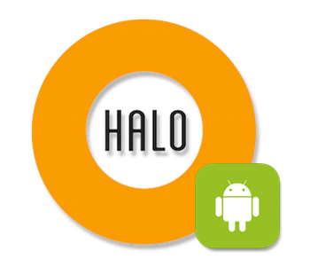

# HALO Android SDK
------------------


[ ](https://bintray.com/halo-mobgen/maven/HALO/_latestVersion)
[](https://maven-badges.herokuapp.com/maven-central/com.mobgen.halo.android/halo-sdk/badge.svg)

## What is HALO? ##
HALO is an MBaaS (Mobile Backend as a Service) that was developed to increase developer productivity and decrease an application's time-to-market by creating a highly modular CMS. A native development team will be able to hook up with HALO in a matter of minutes via the SDK which uses an open API.

To find out the documentation please enter the [documentation page](mobgen.github.io/halo-android).

## Publish a new release ##
Make sure you have setup the correct environment variables in your machine for the bintray username, the
bintray api key, the sonatype user and the sonatype password:
```
HALO_BINTRAY_USER = YOUR_BINTRAY_USER
HALO_BINTRAY_KEY = YOUR_BINTRAY_KEY
HALO_SONATYPE_USER = YOUR_SONATYPE_USER
HALO_SONATYPE_PASSWORD = YOUR_SONATYPE_PASSWORD
```

To publish a release you have to execute the following commands:
```
//Publish the release versions for plugin and sdk
./gradlew -Pproduction installGradlePlugin
./gradlew release/releaseMajorVersion/releaseMinorVersion
```
Make sure to update the version of the plugin or/and the sdk in the gradle.properties file to publish the correct version before uploading.

## LICENSE ##
---------------
```
Copyright 2016 MOBGEN

Licensed under the Apache License, Version 2.0 (the "License");
you may not use this file except in compliance with the License.
You may obtain a copy of the License at

http://www.apache.org/licenses/LICENSE-2.0

Unless required by applicable law or agreed to in writing, software
distributed under the License is distributed on an "AS IS" BASIS,
WITHOUT WARRANTIES OR CONDITIONS OF ANY KIND, either express or implied.
See the License for the specific language governing permissions and
limitations under the License.
```